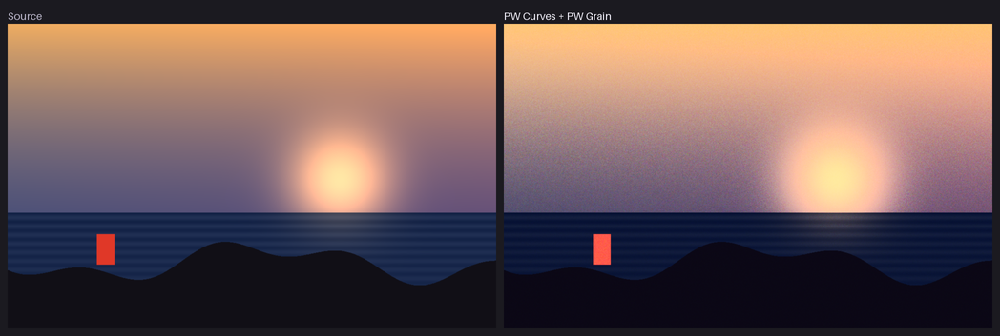
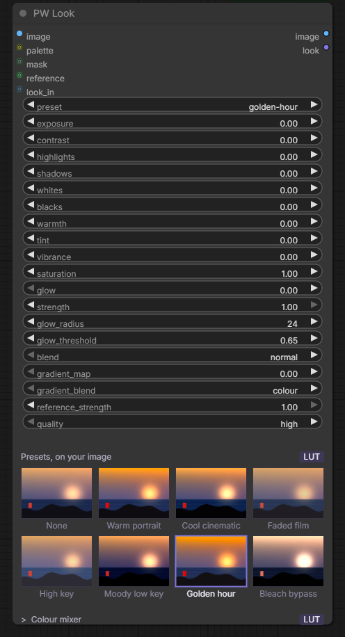
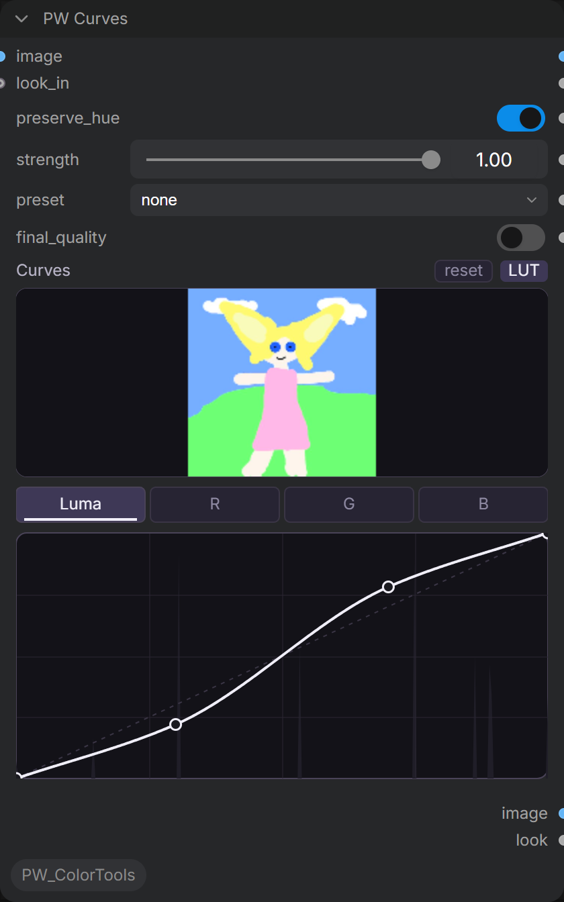
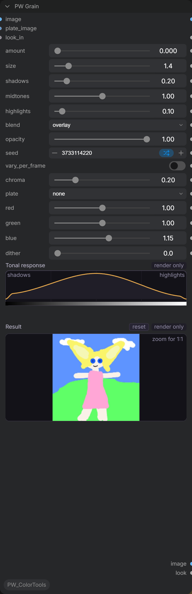
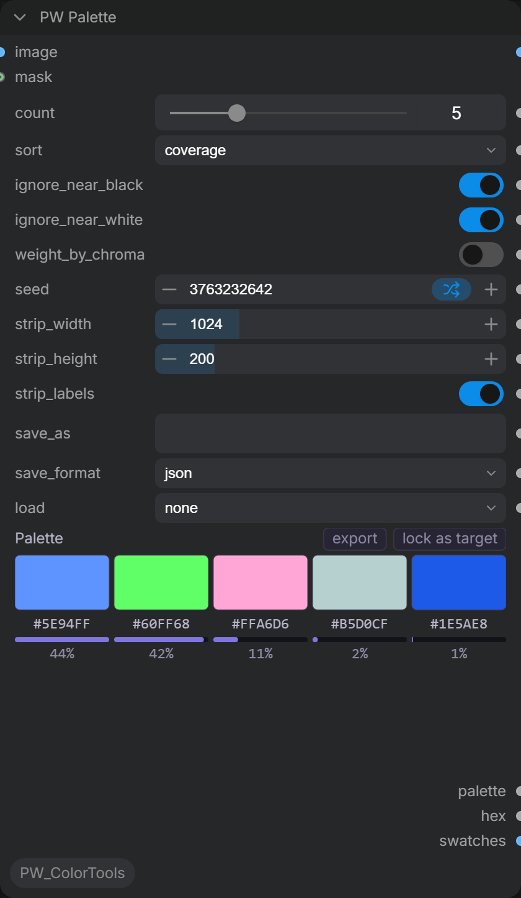
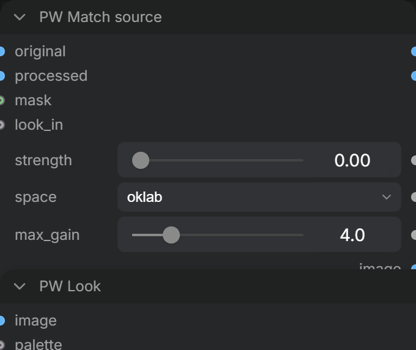
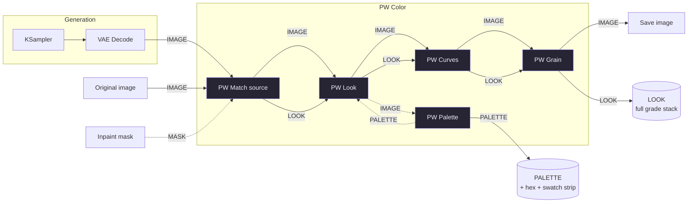

# PW Color Tools

Colour nodes for ComfyUI, built for artists, illustrators and photographers
rather than broadcast colourists. From **Promptwaffle / BotWaffle Studio**.



> **Status: in development.** `PW Look`, `PW Match Source`, `PW Curves`,
> `PW Grain` and `PW Palette` are built and tested. `PW Look I/O`, `PW Optics`
> and `PW Scopes` are the target shape, not what ships today.

---

## Why another colour pack

The existing options are either one node per operation, or enormous film-science
suites. Neither offers a clean interactive UI over a coherent data model. Our
differentiator is **interaction quality and correctness**, not feature count.

**Preview and render are the same pixels.** Per-pixel operations are baked into
a 3D LUT lattice that both the browser and the renderer sample. Not two
implementations of the same maths hoping to agree — byte-identical lattices,
verified in CI on every commit. `.cube` export falls out for free.

**Curves that cannot overshoot.** Monotone cubic interpolation
(Fritsch–Carlson), so no arrangement of control points can produce a ringing
halo or a tone reversal. Catmull-Rom, which most curve nodes use, can do both.

**`preserve hue`.** The luma curve drives OKLab lightness with chroma and hue
held, so raising contrast does not drag skin tones orange.

**The editor works before you run the graph.** Every other pack lists "preview
only works after the graph has run once" as a known limitation. Each node caches
its decoded input and serves it back on request, so the curve editor draws a
real histogram the moment you open it.

**Deterministic.** Same inputs, same output, every time. All randomness is
seeded, and clustering runs on the CPU because CUDA reductions are not
order-deterministic.

---

## The nodes

### PW Look



The main grade panel, in plain language: exposure, contrast, highlights,
shadows, whites, blacks, warmth, tint, vibrance, saturation and glow. No
lift/gamma/gain — our audience thinks in Lightroom, not in colour science.

**Presets are rendered on your own image**, not on stock thumbnails. A strip of
someone else's photos tells you nothing about what a look will do to your frame,
so the node fetches its cached input and bakes each preset onto it with the same
lattice code the renderer uses. Presets lead, sliders follow.

Tone adjustments drive OKLab lightness with chroma and hue held, so pushing
shadows or highlights moves light without moving colour. `vibrance` lifts muted
colour far more than colour that is already saturated; `saturation` scales
everything equally.

A collapsible eight-band **colour mixer** (hue, saturation and lightness per
band) is gated on chroma, so it does not tug at near-neutral pixels whose hue is
numerically defined but visually meaningless — the usual cause of blotchy skies.

The **gradient map** accepts a `PALETTE` input and builds its ramp
automatically, ordered dark to light. Its `colour` mode keeps the image's own
lightness and takes only hue and chroma from the ramp, which is what makes it a
grading tool rather than a poster filter.

An optional `MASK` restricts the whole grade to a region (white is graded), and
an optional `reference` image is matched in OKLab before any creative decision.

Everything above bakes into one lattice. **Glow is the exception** — it blurs,
so it cannot be baked, and the moment it is above zero the node's LOOK is no
longer `.cube`-exportable. That is stated rather than hidden.

### PW Curves



Multi-channel curve editor. Luma, R, G and B tabs; the input histogram rendered
behind the grid; a dashed identity diagonal; a ghost of the pre-edit curve while
you drag.

Click to add a point, shift-click to remove one, shift-drag for fine adjustment,
double-click the canvas to reset the channel. The strength slider blends toward
the identity curve, and its fill runs from the **neutral point** rather than from
zero, so "unchanged" reads at a glance.

The `LUT` badge means this section bakes into a lattice and exports to `.cube`.
Sections that cannot are badged `render only` — we surface the split rather than
pretend it is seamless.

Presets: S-curve, faded, crush, matte, cool shadows, warm highlights. Each is
tested monotone and non-null.

### PW Grain



Film grain with a **tonal response** — strongest in the midtones, weak in the
shadows, absent in pure black and pure white. Uniform noise across the frame is
the single biggest tell of fake grain, so the weighting is not optional. The
curve drawn in the node is the curve applied to your pixels, not an impression
of it; a test pins the two implementations together.

**Grain size is absolute.** 1.4px grain is 1.4px at 1024 and at 4096. The field
is generated at output resolution and never scaled, so a look keeps matching
itself across resolutions.

Procedural or plate-based. Plates are **mean-centred** into a signed deviation
field, so a plate's own exposure never shifts your image, and **cropped, never
resized**, so grain size stays absolute. Per-channel amounts default the blue
channel slightly hotter, matching real stock.

An **always-on dither floor** adds sub-LSB noise before 8-bit quantisation, even
at zero grain. It costs a fraction of a code value and removes banding from
skies and soft gradients — the cheapest quality win in the pack.

### PW Palette



K-means clustering **in OKLab**, so clusters land where the eye sees difference
rather than where RGB does. Cluster in RGB and a night scene returns five
near-identical browns while the one saturated accent gets absorbed.

Outputs a `PALETTE`, a hex string and a rendered swatch strip image. The node
shows colour blocks, hex, coverage bars and percentages. Click a swatch to copy
its hex.

`ignore near-black` and `ignore near-white` default on, because clusters go
where the pixels are and without them a night scene returns five blacks.
`weight by chroma` gives saturated pixels more pull so a 2% accent is not buried
— and deliberately does **not** change the reported coverage, which stays a true
pixel fraction.

Optional mask input, so you can pull the palette of a character rather than the
whole frame.

### PW Match Source



Fixes the colour drift a VAE encode/decode introduces. On a full-frame img2img
nobody notices, because the whole frame shifts together. On an inpaint you
composite the decoded region back over pixels that never went through the VAE,
and the shift becomes a visible seam with a hard edge on the mask boundary.

This measures the drift where it *can* be measured — the region the model did
not paint, which exists in both images — and applies the same correction to the
whole frame, including the part where it could not be measured.

Matching happens in OKLab by default; linear and sRGB are available. A soft mask
weights rather than thresholds, so a feathered inpaint contributes
proportionally instead of falling off a cliff at 0.5.

---

## How it connects



**Order matters.** `PW Match Source` goes first, immediately after the VAE
decode, because it is a repair: it puts the image back where it should have
been before anything creative happens. Grading a drifted image bakes the drift
in.

`PW Look` then `PW Curves` is the useful order — set the look, then shape the
tone response on top of it. Both bake to lattices, so stacking them costs one
extra resample and nothing else.

`PW Grain` goes last. It is a spatial effect, so it cannot be baked into the
LUT, and anything applied after it would filter the grain you just added.

The dashed `PW Palette` loop is optional but worth knowing: extract a palette
from the graded frame, feed it back into `PW Look`'s gradient map, and the ramp
is built from the image's own colours.

**The `LOOK` wire is optional.** It carries the accumulated grade stack so that
downstream nodes — and eventually `PW Look I/O` — can inspect, save or bake the
whole chain to a `.cube`. Images flow whether or not you connect it.

An example workflow is in [`examples/pw_color_basic.json`](examples/pw_color_basic.json).

### Data types

| Type | Carries |
|---|---|
| `LOOK` | The full grade stack as versioned JSON. Every colour node emits one; each op records whether it is LUT-exportable, so a `.cube` export can tell you what it had to drop. |
| `PALETTE` | An ordered list of `{hex, oklab, coverage}` plus a source hash, so a downstream node can tell "this palette is stale" from "the user locked it". |

Both round-trip losslessly through workflow JSON and survive a save/reload
cycle. There are tests for that.

---

## Keeping a palette you liked

A colour combination you hit on in a generation should not disappear with the
workflow.

**Two ways to save.** Set `save_as` and the palette is written on every run to
`output/palettes` — right for a repeatable workflow. Or click **export** on the
node and pick a format, which downloads immediately with no run needed — right
for when you just liked what you saw.

| Format | Reopens here | Goes to |
|---|---|---|
| `.json` | **yes, losslessly** | our own format — keeps coverage and OKLab |
| `.ase` | colours only | Photoshop, Illustrator, InDesign, Affinity |
| `.gpl` | colours only | GIMP, Krita, Inkscape, Aseprite |
| `.txt` | colours only | anything, one hex per line |
| `.css` | — | CSS custom properties (export button only) |

`.ase`, `.gpl` and `.txt` carry colours but not coverage. Reloading one splits
coverage evenly and records that it was reconstructed, rather than inventing
numbers a downstream node would read as measurements.

To bring one back, pick it in the `load` dropdown; refresh the browser after
saving for a new file to appear there. A loaded palette wins over a locked one,
which wins over extracting from the image.

---

## Install

Clone into `ComfyUI/custom_nodes` and restart:

```bash
git clone https://github.com/Fablestarexpanse/PW_ColorTools.git
```

No dependencies beyond torch, numpy and Pillow — all of which ComfyUI already
has. The web bundle is committed, so a plain clone works with no node toolchain.

**Requires** ComfyUI 0.27+ / frontend 1.40+. Developed and tested against
0.29.2 / 1.47.11.

---

## Development

```bash
python -m pytest tests -q
```

```bash
cd web && npm install && npm run typecheck && npm run build
```

The test suite includes a cross-language parity harness: it runs the TypeScript
colour maths under bare `node --experimental-strip-types` and asserts it agrees
with the torch implementation byte for byte after quantisation. If the two ever
drift, the build goes red before a user sees a preview that lies.

Read [ARCHITECTURE.md](ARCHITECTURE.md) before touching `pw_color/lattice.py` or
`web/src/core/` — it records what the parity contract guarantees, what it does
not, and which approaches were measured and rejected.

---

## Not in scope

Deliberately not built, with reasons:

- **A LUT-apply node.** Four good ones already exist; `PW Look` will read
  `.cube` directly.
- **A film stock library.** ComfyUI-Darkroom has 161 measured stocks. We are not
  going to out-research that.
- **Sharpening, clarity, denoise, upscaling, face restoration.** Not colour.
- **ACES / OCIO / working-space selection.** The input is a display-referred
  VAE-decoded tensor; pretending otherwise adds surface area this audience does
  not want. The internals are structured so a working-space transform could be
  inserted later without a rewrite.

---

## Licence

MIT.
